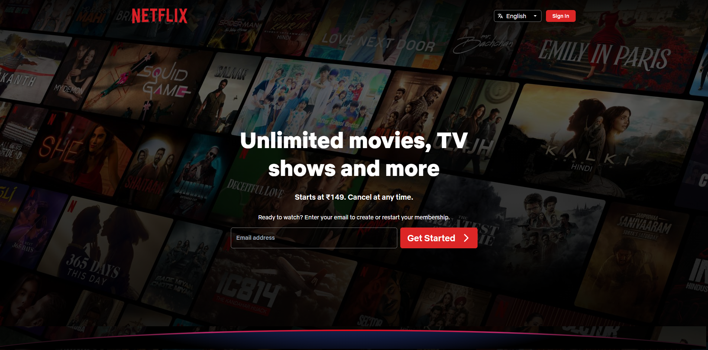
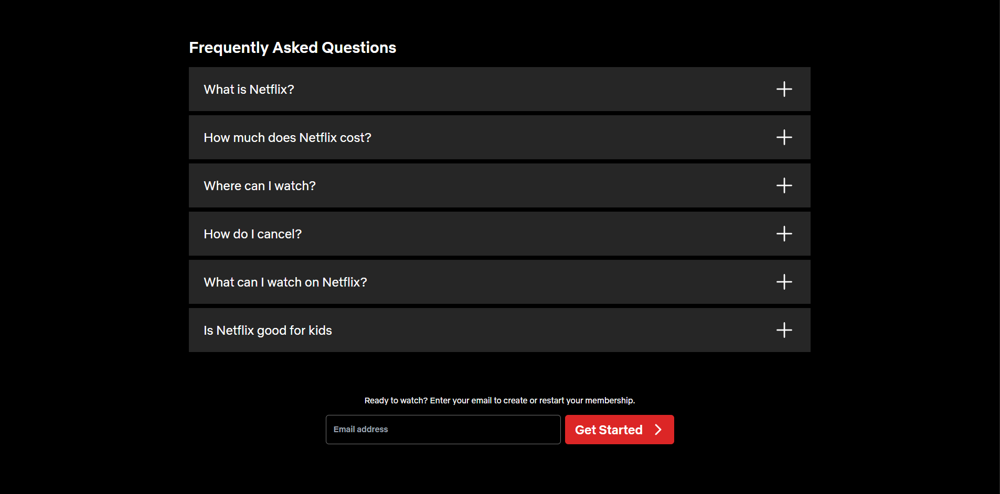
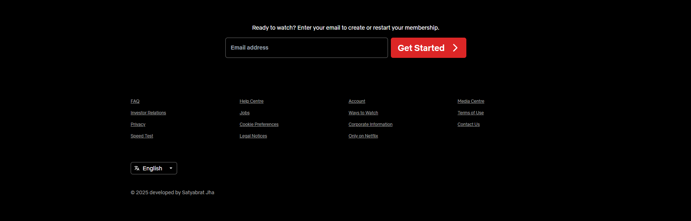
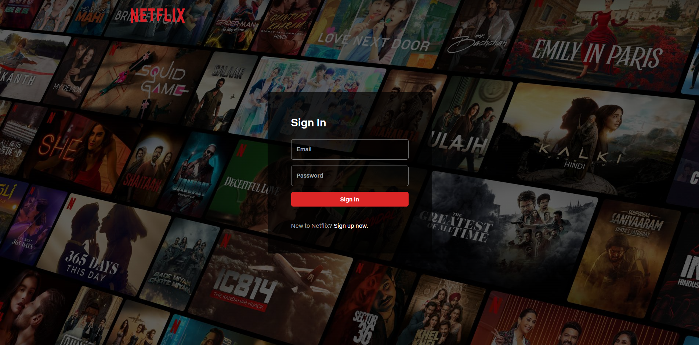
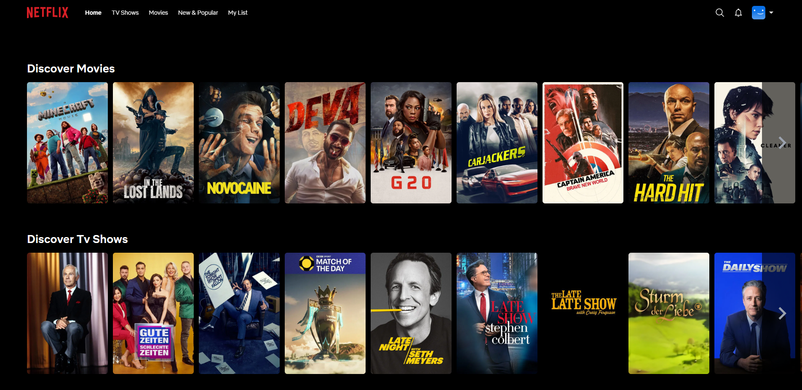
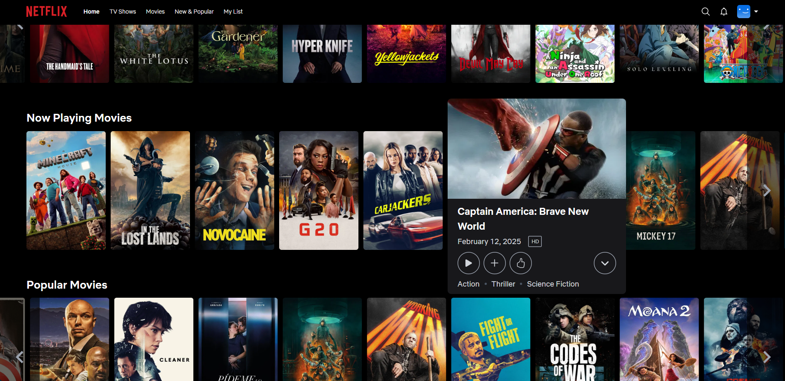

# 🎬 Netflix Clone (MERN Stack + TMDB API)

A full-stack Netflix clone built with the **MERN** stack and **Tailwind CSS**, using **The Movie Database (TMDB) API** to fetch movies and TV shows. The application includes user authentication, video browsing, and dynamic UI elements for an engaging streaming-like experience.

## 🚀 Features

- 🔐 **Authentication** (Register/Login) with JWT and bcrypt
- 🎞️ **Browse Movies & TV Shows** using TMDB API
- 🔍 Search and filter content
- 📺 Separate pages for Movies, TV Shows, and Details
- 🧠 State Management with Redux
- 💅 Responsive UI with Tailwind CSS
- 🧭 Routing with React Router
- 🖱️ Smooth Carousels using `embla-carousel-react`
- ✅ Forms and validation using `react-hook-form`

## 🛠️ Tech Stack

### Frontend

- React
- Tailwind CSS
- React Router DOM
- Axios
- Redux Toolkit
- React Hook Form
- Embla Carousel

### Backend

- Node.js
- Express.js
- MongoDB
- Bcrypt
- JSON Web Token (JWT)

## 🖼️ Screenshots

### Landing Page

### Login Page

### Home Page

